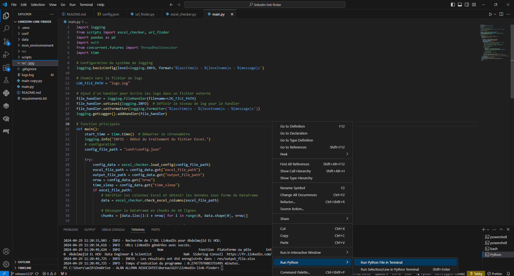

# LinkedIn URL Finder
# Hello, c'est [Abdelmajid][linkedin] 👋
[][website] [][linkedin]

[website]: https://abdelmajidlh.github.io/ePortfolio/
[linkedin]: https://www.linkedin.com/in/aelhou/

## Overview

LinkedIn URL Finder is a Python-based tool designed to automate the process of searching and retrieving LinkedIn profile URLs for a list of individuals. This tool is particularly useful for professionals in recruitment, sales, and marketing who require a quick and efficient way to gather LinkedIn information.

## Features

- **Automated Search**: Automatically performs Google searches to find LinkedIn profiles.
- **Error Handling**: Implements exponential backoff strategy to handle HTTP 429 (Too Many Requests) errors.
- **Parallel Processing**: Utilizes multi-threading to speed up the search process across multiple data chunks.
- **Configurable**: Allows customization through a JSON configuration file.
- **Logging**: Provides detailed logs for monitoring the program's progress and troubleshooting issues.
- **easy to use**: You can run the script on your Windows machine without installing Python.

## Requirements

- Python 3.6 or higher
- `pandas` library
- `openpyxl` library
- `pandas==2.2.2` library
- `requests==2.31.0` library

## Installation

1. Clone the repository:
   ```bash
   git clone https://github.com/AbdelmajidLh/linkedin-link-finder.git
   ```
2. Navigate to the project directory:
   ```bash
   cd linkedin-link-finder
   ```
3. Install the required Python packages:
   ```bash
   pip install -r requirements.txt
   ```

## Configuration

Edit the `conf/config.json` file to set up your configuration:

```json
{
    "excel_file_path": "path/to/your/excel/file.xlsx",
    "output_file_path": "path/to/your/output/file.xlsx"
}
```

- `excel_file_path`: The path to the Excel file containing the data (on windows, use the slash `/` instead of anti-slash `\`).
- `output_file_path`: The path where the output Excel file with LinkedIn URLs will be saved [optional].

## Usage 

### Unix or Windows with Python installed
1. install requirements
```bash
pip install -r requirements.txt
```

2. Run the main script from the command line:
```bash
python main.py
```
On Vscode, right click and run script (see screenshot)



### On Windows
Double click on the Python application `main.exe`.

The program will read the Excel file, process the data in chunks, and save the results with LinkedIn URLs in the specified output file (`res/your_file.xlsx`).

T generate the `exe` file, double click on the `Windows/apk_builder.bat` file.

## Logging

Logs are saved in the `logs` file. Check the logs for detailed information about the program's execution and any errors encountered.

## Contributing

Contributions are welcome! Please feel free to submit pull requests or create issues for bugs and feature requests.

## License

This project is licensed under the MIT License - see the [LICENSE](LICENSE) file for details.

---

**Note**: This tool is intended for legitimate purposes and should be used responsibly following LinkedIn's terms of service. The developers are not responsible for any misuse of this tool.

For any questions or support, please contact [abdelmajid.elhou@gmail.com](mailto:abdelmajid.elhou@gmail.com).